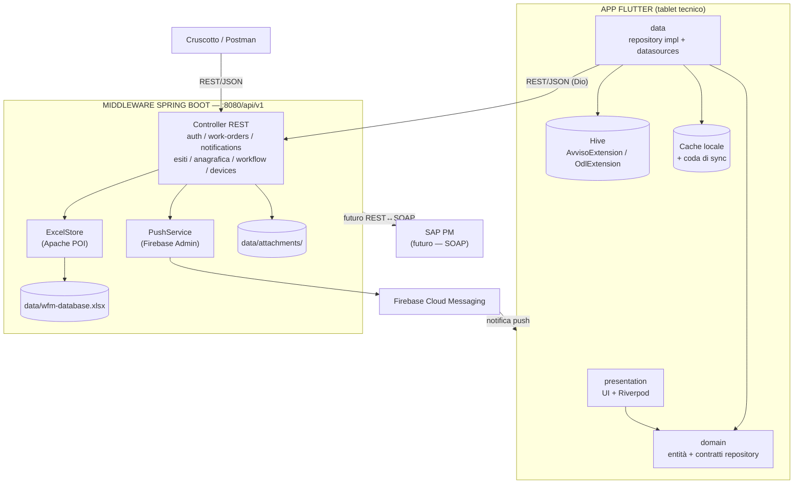
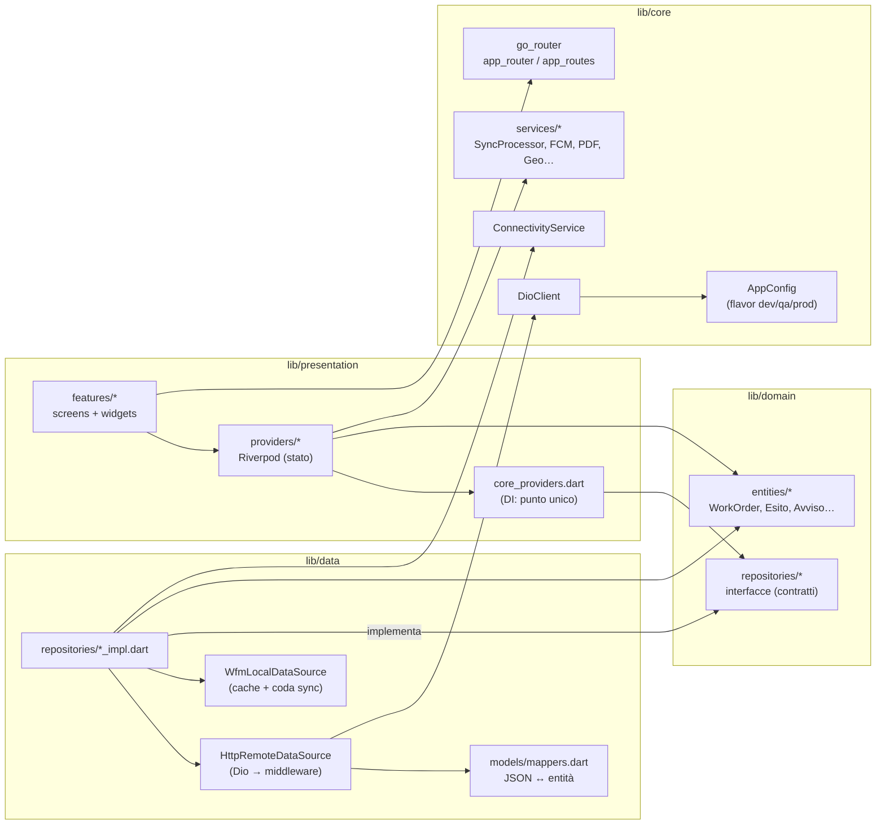
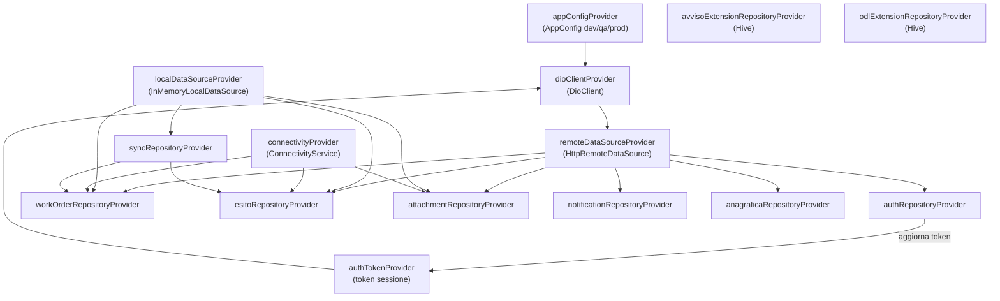
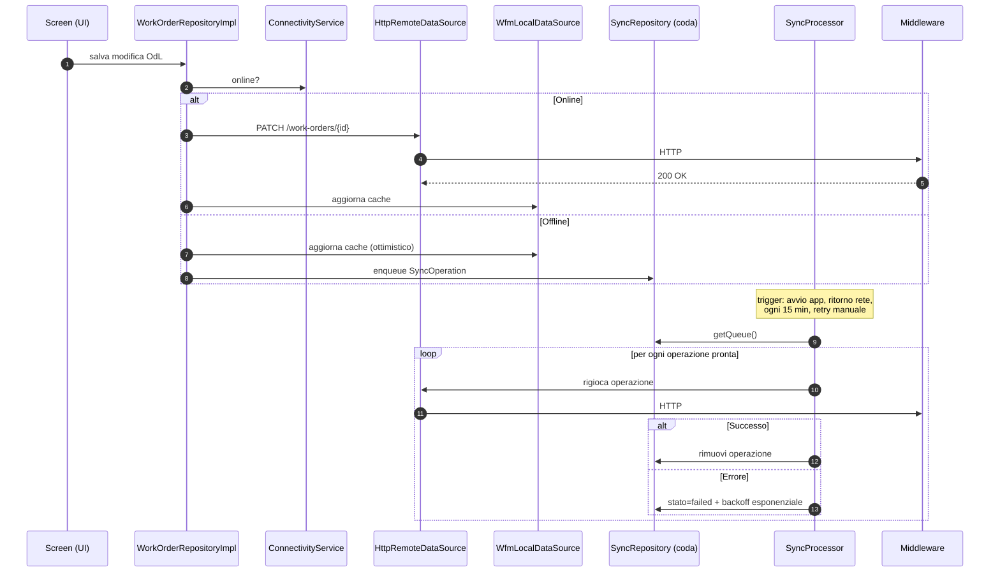
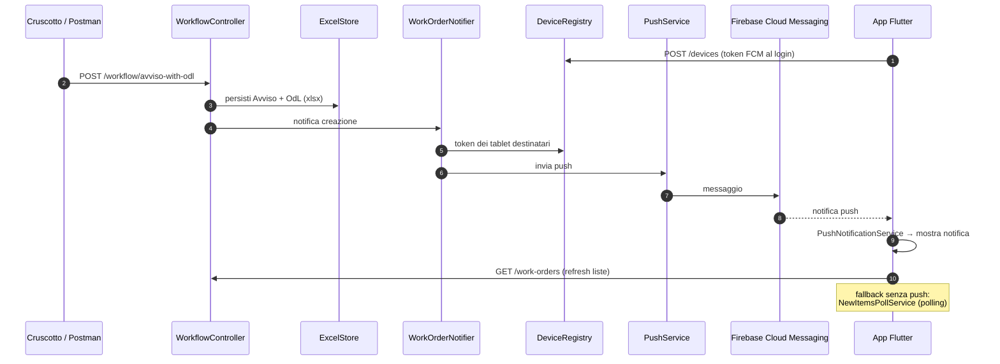
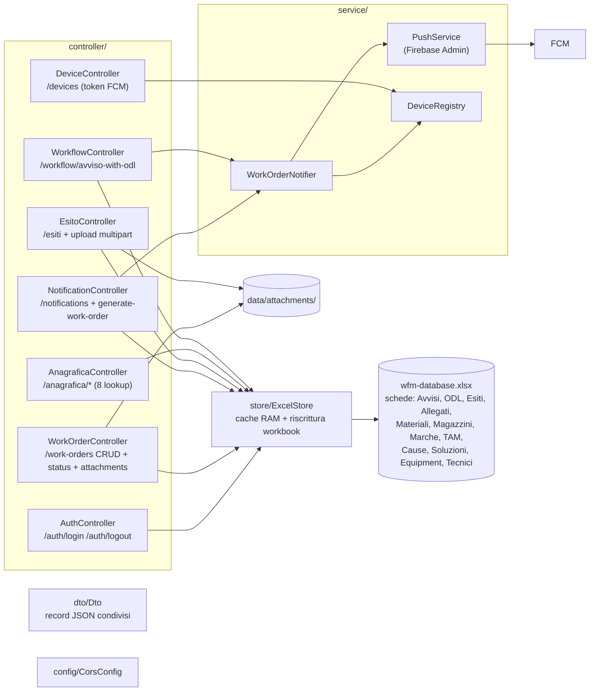
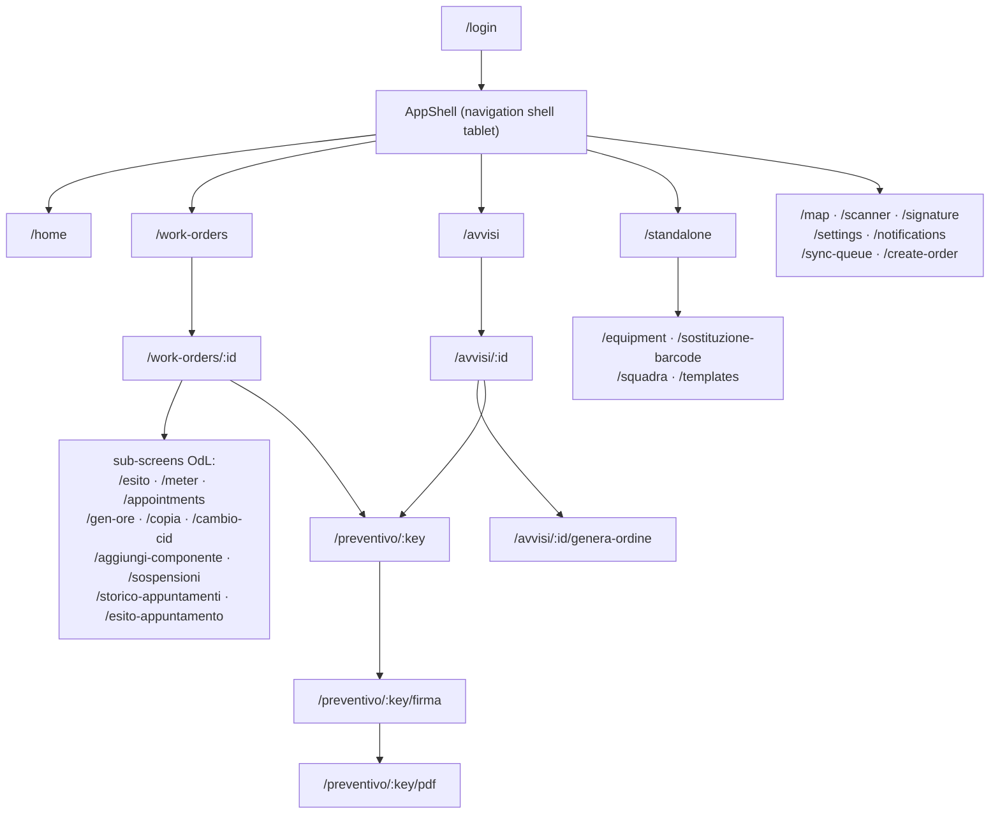
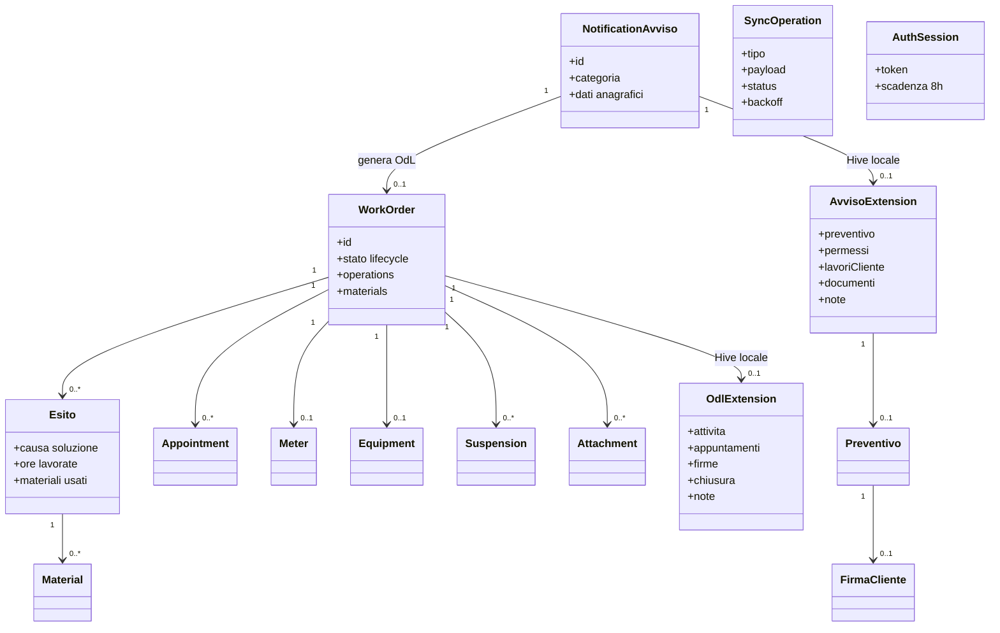

# Architettura — WFM App (diagrammi)

Applicazione **Work Force Management** per tablet (tecnici sul campo): Avvisi e
Ordini di Lavoro (OdL) SAP PM, offline-first, sincronizzazione via middleware.

> **Come importare i diagrammi in draw.io**: copiare il contenuto di un blocco
> ` ```mermaid ` e in draw.io usare **Arrange → Insert → Advanced → Mermaid…**
> (oppure `+` → Mermaid), incollare, **Insert**. draw.io genera il diagramma
> modificabile. Questi diagrammi servono come riferimento per avanzare nel codice.

---

## 1. Vista d'insieme del sistema



Principio chiave: **l'app non parla mai direttamente con SAP**. Il middleware
persiste oggi su Excel (demo pilotata da Postman/Cruscotto) e domani tradurrà
REST ↔ SOAP (parametri già in `application.yml`, sezione `sap.soap`).

---

## 2. Clean Architecture Flutter — layer e dipendenze



Regola: `domain` non dipende da niente; `data` e `presentation` dipendono da
`domain`; `core` è infrastruttura trasversale.

---

## 3. Dependency Injection (core_providers.dart)



---

## 4. Flusso offline-first (sequenza)



---

## 5. Flusso push (creazione Avviso/OdL → tablet)



---

## 6. Middleware — componenti



---

## 7. Navigazione (go_router)



Nota: `/preventivo/:key` accetta come chiave sia il numero Avviso sia il codice
OdL — il flusso Preventivo → Firma → PDF è raggiungibile da entrambi.

---

## 8. Modello di dominio (entità principali)



---

## 9. Decisioni architetturali

1. **Middleware obbligatorio** — l'app è SAP-agnostica; REST ↔ SOAP e
   credenziali SAP vivono solo lato server.
2. **Excel come DB temporaneo** — demo/collaudo via Postman senza
   infrastruttura DB; il contratto REST resta invariato passando a SAP/DB reale.
3. **Estensioni locali Hive** — i dati che SAP non conosce (preventivo, firma,
   note) restano sul tablet, separati dai dati master del backend.
4. **DI centralizzata** in `core_providers.dart` — cambiare un'implementazione
   non impatta la UI.
5. **workmanager rimosso** temporaneamente (embedding Android v1); sync in
   background gestita da `BackgroundSyncService`.
